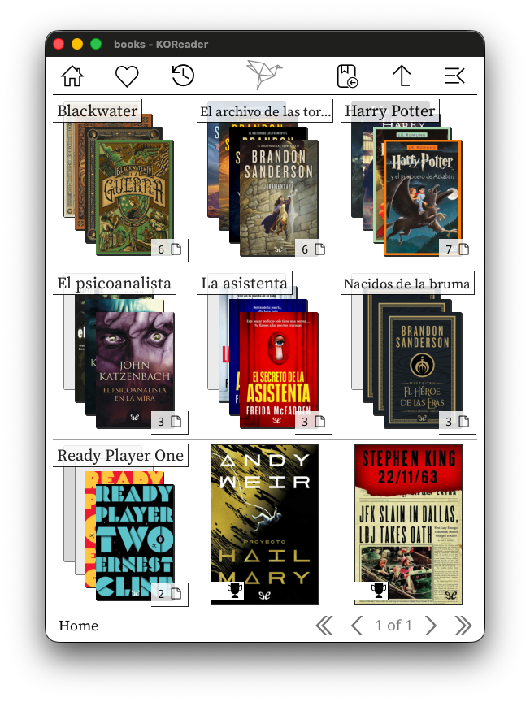
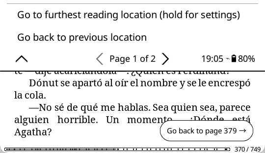

# KOReader Patches

This repository contains custom patches for [KOReader](https://github.com/koreader/koreader). These patches are user scripts that modify KOReader's behavior without altering the core codebase.

## How to Install

1. Download the desired `.lua` file from this repository.
2. Place the file into the `koreader/patches/` directory on your device.
   - If the `patches` directory doesn't exist inside `koreader`, create it.
3. Restart KOReader.

---

## [2-automatic-book-series.lua](2-automatic-book-series.lua): Automatic Book Series

A patch that automatically groups books belonging to the same series into virtual folders within the File Browser.

### Features
- **Virtual Grouping**: Instead of seeing 10+ books scattered in a folder, you'll see a single virtual folder for the series (e.g., "Harry Potter").
- **Seamless Integration**: Works directly in your existing folder structure. No need to reorganize your files or use Calibre.
- **Automatic Sorting**: Books inside the virtual folder are sorted automatically by their series index.
- **Smart Skipping**: Single books from a series won't be grouped. If all books in a folder belong to the same series, grouping is skipped to avoid creating virtual folders inside your existing series folders.
- **Toggleable**: Can be enabled/disabled via the File Browser menu.

### How to Use
1. Install the patch as described above.
2. Open the File Browser.
3. To toggle the feature, go to the top menu:
   - **File Browser** (first icon) → **Settings** → **Group book series into folders**

### Compatibility
This patch is designed to work harmoniously with other popular plugins and patches:
- **ProjectTitle / CoverBrowser**: Fully compatible. Virtual series folders will display cover images (either grid or stack) generated from the books inside them.
- **browser-folder-cover patch**: Supported. The virtual folder icon will display the number of books it contains (e.g., "7 📁").
- **browser-up-folder patch**: Supported. If you use a patch to hide/show the `../` (up) item, this patch respects that setting inside virtual folders.

### Release Notes

**v1.0.5 (Current)**
- Fixed virtual folder covers not displaying with newer versions of ProjectTitle

**v1.0.4**
- Improved performance when browsing folders with many books
- Improved compatibility with browser-up-folder extension
- Fixed: Page position is now properly restored when navigating folders or returning from a book
- Series grouping no longer appears in folder selection dialogs
- Various code optimizations and bug fixes

**v1.0.3**
- Improved detection of ProjectTitle plugin
- Fixed some issues with the go-up/home buttons not remembering the page number

**v1.0.2**
- Fixed crash when displaying covers for certain books
- Series folders now properly reopen after reading a book

**v1.0.1**
- Prevent crashes from books with missing metadata
- Avoid grouping if only one book of the series exists
- Don't group series inside existing series folders

**v1.0.0**
- Initial release
- Automatically groups books into virtual series folders
- Works with both default and ProjectTitle cover browsers

---

## [2-track-reading-location.lua](2-track-reading-location.lua): Track Reading Location

A patch that remembers the furthest page you've actually read in a book, and offers a quick way back if you jump away from it (backward via the progress bar, or forward via the table of contents, etc.).

### Features
- **Smart Detection**: A small floating pill-shaped button appears at the bottom-right of the screen when you page backward more than one page at once, or at the bottom-left when you jump forward more than two pages at once (e.g. tapping a table of contents entry).
- **One-Tap Return**: Tap the button (or its "Go back" side) to jump straight back to your furthest reading location.
- **Configurable Appearance**: Independently toggle "Show full text", "Show page number", and "Show dismiss button" - with everything off, the button shrinks to a small circular arrow.
- **Adjustable Position**: "Bottom offset" and "Side offset" settings let you move the button further from the screen edges (useful to avoid overlapping other UI elements), applied identically to both docking corners, with a live preview while you adjust them.
- **Dismiss or Accept**: Tap the "X" (or hold the button if it's hidden) to cancel the prompt and accept your current page as the new reference point.
- **Menu & Gesture Access**: A "Go to furthest reading location" entry sits in the Reader menu under Navigation (right below "Go forward to next location"). It's also registered as a system action, so it can be bound to a gesture via the gesture manager, and is available anywhere else KOReader exposes registered actions - e.g. the Bookshelf quick menu, [Shortcuts Toolbar](https://github.com/xusoo/shortcutstoolbar.koplugin), and similar plugins.
- **Persistent Per-Book**: The reference page is saved per book, so a pending prompt is still there if you close the book and reopen it later.
- **Universal**: Works with both paginated documents (PDF, CBZ, DjVu...) and reflowable documents (EPUB, FB2...).

### How to Use
1. Install the patch as described above.
2. Just read normally - the button appears automatically when you jump backward or forward significantly.
3. Tap the button to jump back, or tap/hold the "X" to dismiss it and accept your current position.
4. To adjust behavior, go to the Reader menu → Navigation, and hold "Go to furthest reading location" to open its settings submenu.

### Release Notes

**v1.0.0 (Current)**
- Initial release
